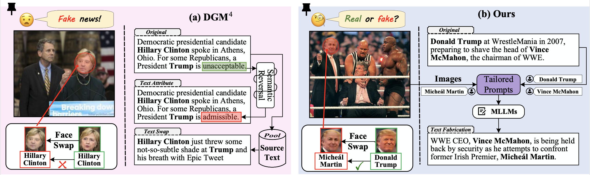

# **The Coherence Trap**: When MLLM-Crafted Narratives Exploit Manipulated Visual Contexts

<font size=4><div align='center' > [[🤗 Datasets](https://www.kaggle.com/datasets/yaxiongwang/mdsm-dataset-under-review/data)] </div></font>

## 🔥 Overview

We propose MLLM-Driven Synthetic Multimodal (**MDSM**), a large scale,  semantic-aligned multi-modal benchmark with  high-fidelity texts from MLLM, supporting fake news detecting and grounding tasks.
<a href="">
  
</a>


And AMDxxxxxx


## Setup

```shell
conda create -n AMD python=3.10
conda activate AMD
pip install -r requirements.txt
```

If you encounter issues with flash-attn, you can fix it with the following command:

```shell
pip install -U flash-attn --no-build-isolation
```

Alternatively, you can visit the [flash-attention releases page](https://github.com/Dao-AILab/flash-attention/releases) to find the version compatible with your environment and follow the installation instructions provided there.

## Data

Our dataset now is avaliable at [kaggle](https://www.kaggle.com/datasets/yaxiongwang/mdsm-dataset-under-review/data).

You can also prepare your training or inference data like:

```
images/:
    image1.png
    image2.png
test.json:
[
    {
        "id": 1556711,
        "image": "image1.jpg",
        "text": "your text1",
        "fake_cls": "orig",
        "fake_image_box": [],
        "mtcnn_boxes": [
            [
                113,
                27,
                208,
                165
            ],
            [
                436,
                56,
                491,
                124
            ]
        ]
    },
    {
        "id": 236385,
        "image": "DGM4/origin/usa_today/0244/128.jpg",
        "text": "your text1",
        "fake_cls": "face_swap&text_swap",
        "fake_image_box": [
                64,
                48,
                145,
                159
        ],
        "mtcnn_boxes": [
            [
                64,
                48,
                145,
                159
            ],
            [
                104,
                180,
                179,
                285
            ]
        ]
    },
]
```

## Inference

We provide an example here

```shell
cd evaluation/
bash test.sh
```

Please fill the MODEL_PATH, IMG_PATH, TEST_JSON with your real checkpoint path and data path.

## Training

```shell
cd src/script/
bash train.sh
```


## 🗞️ News

- **`2025-05-15`**: We release the [datasets](https://www.kaggle.com/datasets/yaxiongwang/mdsm-dataset-under-review/data) of the AMD (v1) model.
- **`2025-05-15`**: We release the UI-R1 repository.


## 🤝 Acknowledgements

We sincerely thank projects [DGM4](https://github.com/rshaojimmy/MultiModal-DeepFake), [FKA-Owl](https://github.com/liuxuannan/FAK-Owl), and [Florence2](https://github.com/andimarafioti/florence2-finetuning) for providing their open-source resources.